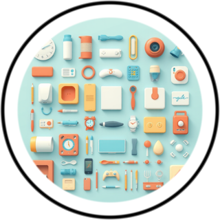
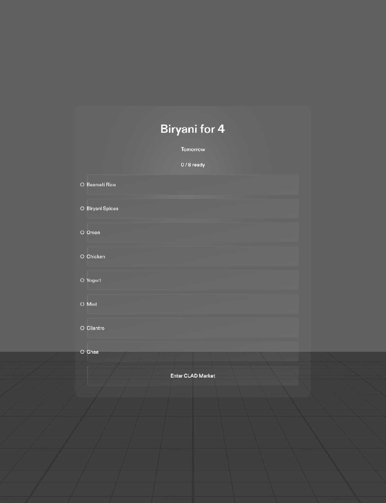
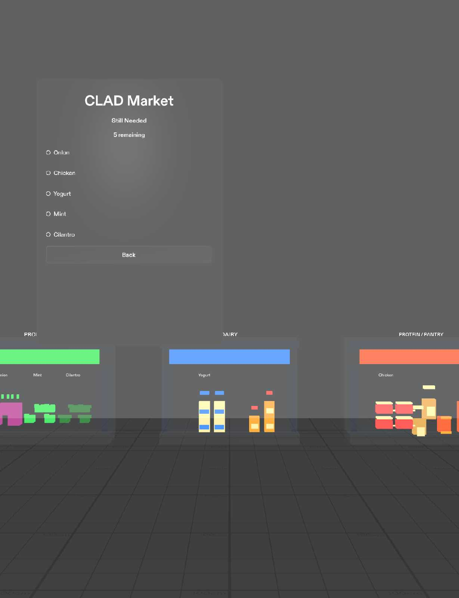
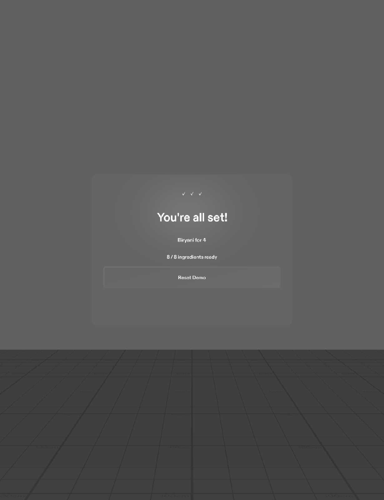
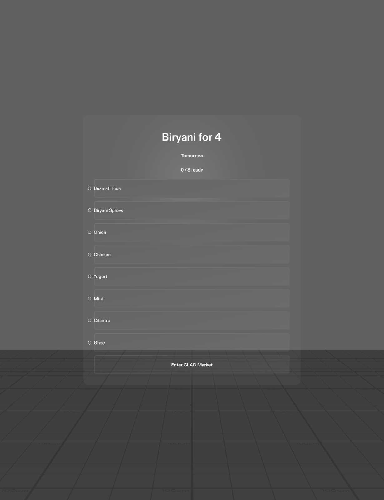
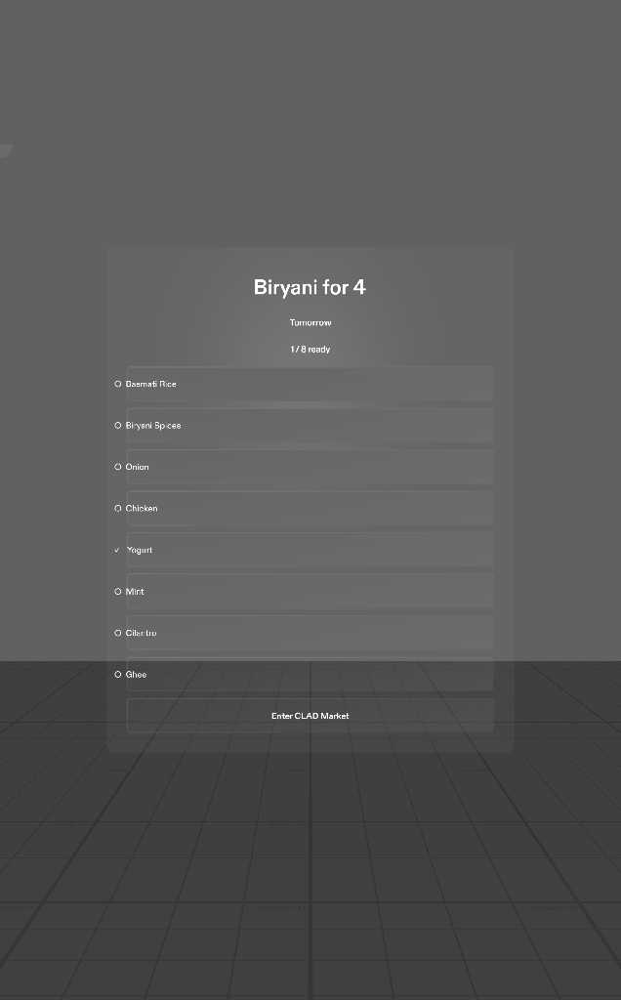

# CLAD Organizer

<p align="center">
  
</p>

CLAD Organizer turns a real-world request into a clear spatial checklist, then guides the user through the physical items needed to complete it. It is designed for SPECS and built with CLAD in Lens Studio.

## Demo

<p align="center">
  <video
    src="media/CLAD_Organizer_Demo.mp4"
    poster="media/screenshots/final-qa-market.jpg"
    controls
    playsinline
    width="360">
  </video>
</p>

The demo follows a dinner-planning flow: create a plan, identify what is already available, enter CLAD Market, collect what remains, and finish with one synchronized completion state.

## How it works

1. Ask CLAD to organize a task by typing or speaking it.
2. CLAD prepares a checklist, such as dinner hosting or chicken biryani for four.
3. Mark items already available, then enter the spatial market.
4. Select remaining items in the world; the checklist updates immediately.
5. Finish with an organized, ready-to-go plan.

## Gallery

| Planning | Spatial market | Completion |
| --- | --- | --- |
|  |  |  |

| Voxel market | Checklist stays in sync |
| --- | --- |
|  |  |

## Run locally

1. Install Lens Studio 5.22 or later.
2. Open `CLAD-organize.esproj`.
3. Open `Assets/Scene.scene` and start Interactive Preview.
4. Use the organizer to make a plan, mark owned items, enter CLAD Market, and complete the list.

## Project structure

```text
Assets/
  Scripts/                 Organizer state, checklist, market UI, and interactions
  Materials/ Meshes/       Lightweight voxel-market presentation
  Scene.scene              Lens Studio scene
media/
  CLAD_Organizer_Demo.mp4  Vertical product film
  screenshots/             Product and interaction captures
PROMPT_LOG.md              Development prompt history
```

## Credits

Created by Jayasri Guthula.
